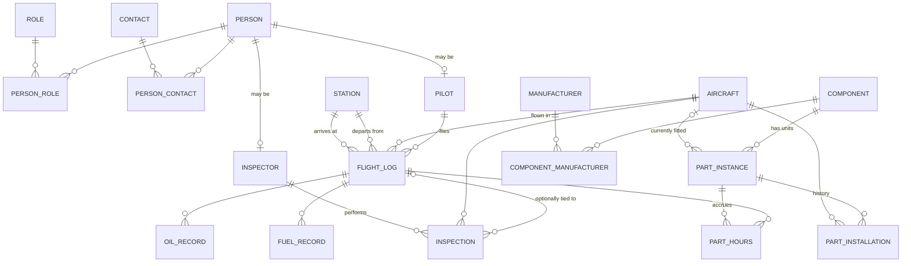
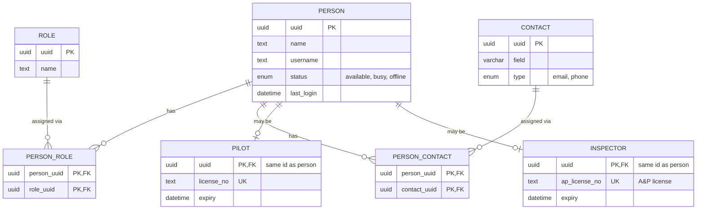
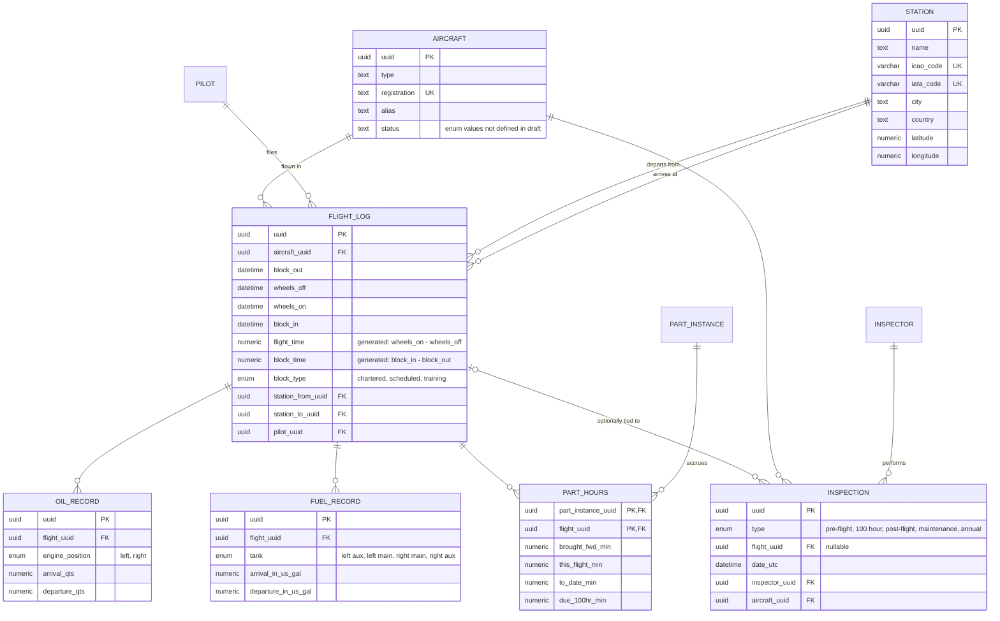
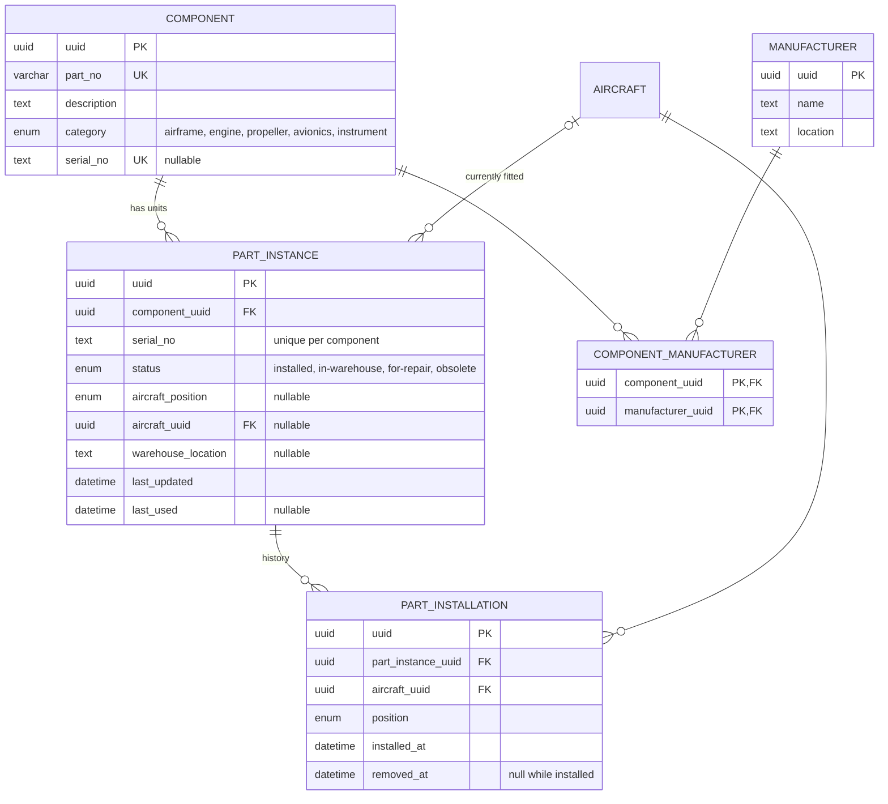

# Backend Database Schema

Data model for people, aircraft operations and parts inventory.

Source: [`backend_schema_draft.xlsx`](https://docs.google.com/spreadsheets/d/1nGp604nbzjd1llN7V1WXxKogeY4LzltIpCVq6a7BG-4/edit?gid=1237754419#gid=1237754419)
(sheets: **Employee**, **Aircraft**, **Inventory**).

Executable DDL (PostgreSQL 13+) is in [`schema.sql`](./schema.sql).

Conventions: 
- every primary key column is named `uuid`
- foreign keys are named `<entity>_uuid`
- columns not marked nullable are `NOT NULL`
- Times are stored as `timestamptz` (UTC).

## Overview

Relationships only. Attributes are in the per-domain diagrams below.

## People (Employee sheet)

## Flight operations (Aircraft sheet)

## Inventory (Inventory sheet)

